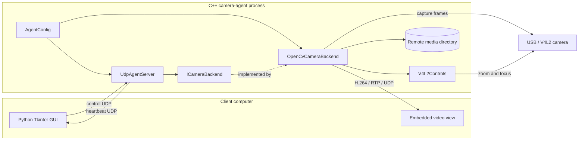

# One remote camera agent

The first implementation controls one configured V4L2 camera from one C++
process. It deliberately uses a small LAN-only protocol instead of introducing
gRPC, a database, or a service framework.

## Block diagram



Only the camera backend opens the video device. Photos and recordings stay on
the agent computer. Live frames bypass the command protocol and travel directly
to the configured client.

## Components

### `AgentConfig`

Loads a small `key=value` file. The required deployment values are:

- `camera_device`: local V4L2 path such as `/dev/video0`;
- `client_host`: IPv4 address of the computer running the GUI.

It also contains the media directory, capture dimensions, frame rate, JPEG
quality, three UDP ports, and heartbeat interval. Unknown keys and invalid
values fail startup instead of being silently ignored.

### `UdpAgentServer`

Owns the minimal control plane. It:

- binds the configured command port;
- sends periodic heartbeats to `client_host`;
- accepts commands only from that configured IPv4 address;
- forwards commands to the shared `CameraController`;
- reports success or errors to the GUI.

Supported messages are intentionally fixed:

```text
PHOTO
RECORD_START
RECORD_STOP
STREAM_START
STREAM_STOP
STATUS
```

UDP makes this implementation small, but does not provide authentication,
encryption, guaranteed delivery, or durable operations. It is suitable only for
the trusted-LAN prototype. A later gRPC service can replace this class without
changing the camera backend.

### `CameraController` and local CLI

`CameraController` owns the recording, network-streaming, and local-preview
state shared by all command sources. It serializes backend operations and
generates photo/video filenames under `media_directory`. Both `UdpAgentServer`
and the optional interactive CLI call this controller, so they cannot disagree
about which outputs are active.

Run the agent with `--interactive` to enable local commands for photos,
recording, status, and an OpenCV HighGUI preview. The preview reuses the latest
frame from the existing capture thread; it never opens the camera a second time.

### `ICameraBackend`

The interface contains only the operations used by the server:

```cpp
class ICameraBackend {
public:
    virtual ~ICameraBackend() = default;
    virtual CameraCapabilities capabilities() const = 0;
    virtual void set_controls(const ControlPatch&) = 0;
    virtual void take_photo(const std::filesystem::path&) = 0;
    virtual void start_recording(const std::filesystem::path&) = 0;
    virtual void stop_recording() = 0;
    virtual void start_live_stream(const LiveStreamTarget&) = 0;
    virtual void stop_live_stream() = 0;
    virtual void start_local_preview() = 0;
    virtual void stop_local_preview() = 0;
};
```

### `OpenCvCameraBackend`

Owns one `cv::VideoCapture` and one capture thread. Each captured frame:

- replaces the latest frame used for photos;
- is written to a local `cv::VideoWriter` when recording;
- is written to an OpenCV/GStreamer RTP output when streaming.

An optional preview worker copies the latest frame and owns all `imshow`,
`waitKey`, and window-destruction calls.

This allows photo, recording, and streaming requests without opening the camera
more than once. It encodes recording and live video separately; sharing one
encoder is a future optimization only if CPU measurements justify it.

### `V4L2Controls`

Queries and applies zoom, autofocus, and manual focus. It remains separate
because OpenCV does not reliably expose device-specific control ranges.

### Python GUI

The Tkinter GUI has two small responsibilities:

- listen for heartbeats and send control messages;
- use `StreamReceiver` to decode RTP with GStreamer and place the newest RGB
  frame in the UI.

The GUI considers the agent offline after three seconds without a heartbeat.
Only the newest decoded frame is queued, preventing latency and memory growth
when painting is slower than video decoding.

## Runtime flows

Photo and recording commands create files only on the agent:

```text
GUI -> UDP command -> UdpAgentServer -> OpenCvCameraBackend -> remote file
                         |
GUI <- UDP result -------+
```

Live video uses a separate low-latency path:

```text
GUI -> STREAM_START -> agent
GUI embedded view <- H.264/RTP/UDP <- OpenCvCameraBackend
```

## KISS and SOLID decisions

- One agent instance owns one camera.
- One capture thread distributes frames to all active outputs.
- Configuration uses `key=value`, not a configuration framework.
- `UdpAgentServer` and `LocalCli` handle command input; `CameraController`
  coordinates shared state; `OpenCvCameraBackend` handles media; `V4L2Controls`
  handles device controls.
- The server depends on `ICameraBackend`, allowing a future fake or hardware
  backend without changing the protocol code.
- There is no actor framework, message bus, database, plugin loader, RTSP server,
  WebRTC stack, or dependency-injection framework.

## Current files

```text
agent/
  include/camera_agent/
    agent_config.hpp
    camera_backend.hpp
    camera_controller.hpp
    camera_types.hpp
    local_cli.hpp
    opencv_camera_backend.hpp
    udp_agent_server.hpp
    v4l2_controls.hpp
  src/
    main.cpp
    agent_config.cpp
    camera_controller.cpp
    local_cli.cpp
    udp_agent_server.cpp
    backends/opencv_camera_backend.cpp
    backends/v4l2_controls.cpp
client/
  camera_manager_gui.py
  stream_receiver.py
  view_stream.py
config/
  agent.conf.example
```
