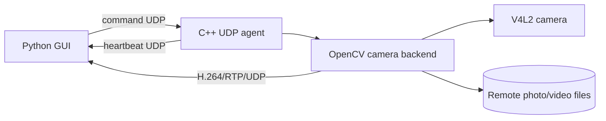

# Architecture

## Current scope

The current prototype targets one Linux agent, one UVC/V4L2 camera, and one
Python GUI on a trusted LAN. One agent process owns one camera. Additional
cameras use additional agent instances.

It supports:

- periodic online/offline heartbeats;
- remote photo requests, stored on the agent;
- remote recording start/stop, stored on the agent;
- a live H.264/RTP/UDP stream displayed inside the GUI;
- backend support for zoom, autofocus, and manual focus.

File download, multi-agent aggregation, authentication, internet transport,
audio, and synchronized cameras are not implemented yet.

## System view



The command and media paths are separate. Small command/status messages use
UDP. Encoded live frames never pass through the command protocol.

## Agent components

`AgentConfig`
: Loads the camera device, GUI host, media directory, capture settings, ports,
  and heartbeat interval from a `key=value` file.

`UdpAgentServer`
: Sends heartbeats, receives fixed commands from the configured client host,
  generates safe media filenames, and invokes the backend.

`ICameraBackend`
: Keeps network code independent of the camera implementation.

`OpenCvCameraBackend`
: Owns one camera capture thread, the latest frame, local recording writer, and
  live RTP writer.

`V4L2Controls`
: Handles the small set of device controls that OpenCV cannot reliably describe.

The concrete class and flow details are in [One remote camera agent](agent-design.md).

## Client components

`CameraManagerGui`
: Listens for heartbeats and command results, updates online/recording/streaming
  state, and sends button requests to the discovered agent address.

`StreamReceiver`
: Uses GStreamer to receive/decode RTP. It keeps only the newest RGB frame for
  Tkinter, preventing an ever-growing display queue.

## Configuration

The remote agent reads one configuration file:

```ini
client_host=192.168.1.20
camera_device=/dev/video0
media_directory=media
width=1280
height=720
fps=30
jpeg_quality=90
command_port=7000
heartbeat_port=7001
stream_port=5000
heartbeat_interval_ms=1000
```

`client_host` is the GUI computer's IPv4 address. Commands are accepted only
from that address. Client input never supplies a remote filesystem path.

## Minimal UDP protocol

The GUI sends one of these exact messages to the command port:

```text
PHOTO
RECORD_START
RECORD_STOP
STREAM_START
STREAM_STOP
STATUS
```

The agent replies with `OK ...` or `ERROR ...`. Heartbeats have this form:

```text
CAMERA_MANAGER|ONLINE|recording=0|streaming=0|command_port=7000|stream_port=5000
```

The GUI uses the heartbeat packet's source IP and advertised command port. It
marks the agent offline after three seconds without a heartbeat.

UDP requests are not guaranteed or idempotent. This is an intentional prototype
tradeoff. If operational testing shows a need for reliable retries, artifact
downloads, multiple controllers, or authentication, replace `UdpAgentServer`
with gRPC while retaining `ICameraBackend`.

## Concurrency

- OpenCV capture runs on one `std::jthread`.
- The UDP command loop handles one command at a time.
- A small mutex protects the latest frame and two video writers.
- Heartbeat state is atomic and does not block capture.
- Tkinter runs only on the Python main thread; socket receive and GStreamer
  callbacks hand data to bounded queues.

## Security boundary

The current UDP control and RTP media are unencrypted. Restrict them to a
trusted LAN and firewall the configured ports. Checking the configured client
IP prevents accidental commands from other hosts but is not authentication and
does not prevent spoofing.

Before exposing an agent outside a trusted network, add authenticated TLS
control and encrypted media such as WebRTC/SRTP.

## Repository layout

```text
agent/
  include/camera_agent/
  src/
    backends/
  tests/
  tools/
client/
  camera_manager_gui.py
  stream_receiver.py
  view_stream.py
config/
  agent.conf.example
docs/
```

